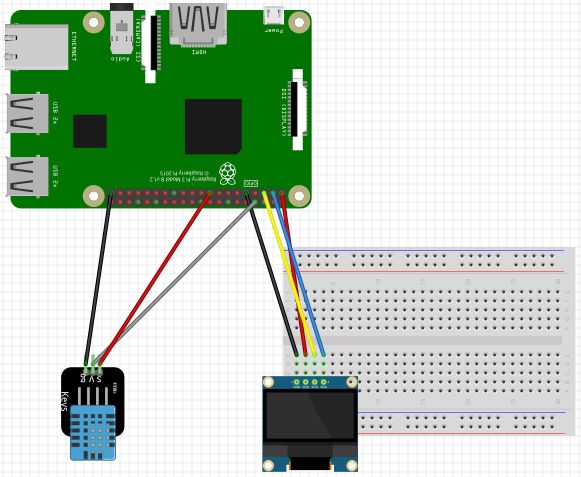
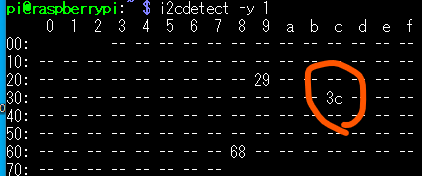
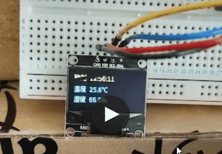

# SSD1306表示確認（DTH11の温湿度結果を表示）
DTH11(温湿度計)を利用した、SSD1306 有機LEディスプレイの表示確認です。

## 事前準備

- 以下のコマンドで、SSD1306用のライブラリをインストールする
  > pip3 isntall adafruit-circuitpython-ssd1306
  
- 以下のコマンドを実行し、表示用のフォント(Noto)をインストールする
  > sudo apt-get install fonts-noto

  これにより、ソースで指定されている`/usr/share/fonts/opentype/noto/`に`NotoSansCJK-Regular.ttc`が保存されます。

## 接続方法
下図のとおり接続してください。

</src>

  - DTH11はPIN14に接続します。
  - SSD1306をI2C(SDA/SCL)につなぐと、アドレス0x3Cに接続されます。うまく表示されない場合は、下図のコマンドで接続できているか確認しましょう。

</src>

## 実行コマンドと結果
以下の通り、コマンドを実行します。
  > python3 dispThermoHygroMeter.py

下図のように温度表示されます。
</src>

